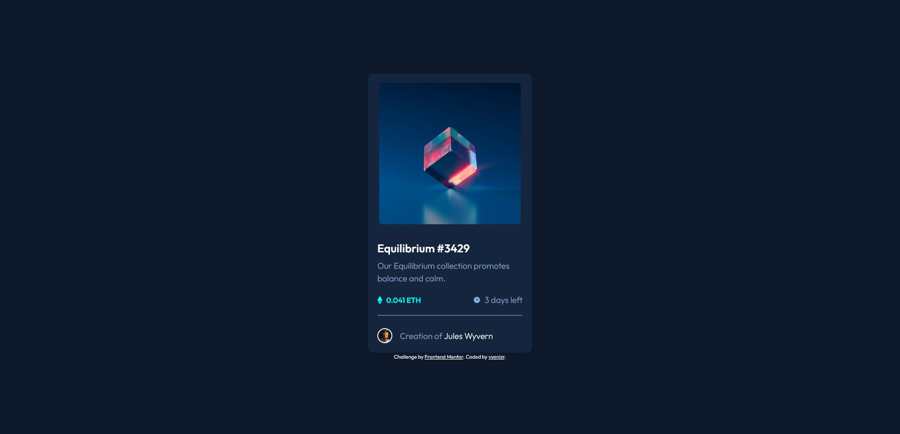

# Frontend Mentor - NFT preview card component solution

This is a solution to the [NFT preview card component challenge on Frontend Mentor](https://www.frontendmentor.io/challenges/nft-preview-card-component-SbdUL_w0U). Frontend Mentor challenges help you improve your coding skills by building realistic projects.

## Table of contents

- [Frontend Mentor - NFT preview card component solution](#frontend-mentor---nft-preview-card-component-solution)
  - [Table of contents](#table-of-contents)
  - [Overview](#overview)
    - [The challenge](#the-challenge)
    - [Screenshot](#screenshot)
    - [Links](#links)
  - [My process](#my-process)
    - [Built with](#built-with)
    - [What I learned](#what-i-learned)
    - [Useful resources](#useful-resources)
  - [Author](#author)

## Overview

### The challenge

Users should be able to:

- View the optimal layout depending on their device's screen size
- See hover states for interactive elements

### Screenshot



### Links

- [Solution URL](https://github.com/vyonizr/fm-nft-preview-card-component)
- [Live site URL](https://vyonizr.github.io/fm-nft-preview-card-component/)

## My process

### Built with

- HTML5 markup
- Mobile-first workflow
- [Tailwind CSS](https://tailwindcss.com/) - For styles

### What I learned

To center an absolute element with Tailwind CSS, add the following classes:

```
absolute top-1/2 left-1/2 z-20 -translate-x-1/2 -translate-y-1/2 transform
```

### Useful resources

- [Handling Hover, Focus, and Other States](https://tailwindcss.com/docs/hover-focus-and-other-states) - This helped me grouping active states with Tailwind CSS.

## Author

- Website - [vyonizr.com](https://vyonizr.com/)
- Frontend Mentor - [@vyonizr](https://www.frontendmentor.io/profile/vyonizr)
